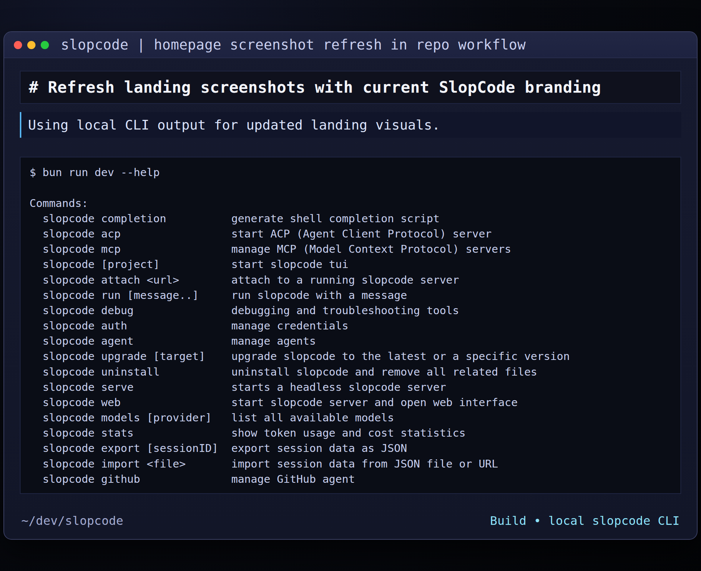

<p align="center">
  <a href="https://slopcode.dev">
    <picture>
      <source srcset="packages/console/app/src/asset/logo-ornate-dark.svg" media="(prefers-color-scheme: dark)">
      <source srcset="packages/console/app/src/asset/logo-ornate-light.svg" media="(prefers-color-scheme: light)">
      
    </picture>
  </a>
</p>
<p align="center">L’agente di coding AI open source.</p>
<p align="center">
  <a href="https://slopcode.dev/discord"></a>
  <a href="https://www.npmjs.com/package/slopcode"></a>
  <a href="http://github.com/teamslop/slopcode/actions/workflows/publish.yml"></a>
</p>

<p align="center">
  <a href="README.md">English</a> |
  <a href="README.zh.md">简体中文</a> |
  <a href="README.zht.md">繁體中文</a> |
  <a href="README.ko.md">한국어</a> |
  <a href="README.de.md">Deutsch</a> |
  <a href="README.es.md">Español</a> |
  <a href="README.fr.md">Français</a> |
  <a href="README.it.md">Italiano</a> |
  <a href="README.da.md">Dansk</a> |
  <a href="README.ja.md">日本語</a> |
  <a href="README.pl.md">Polski</a> |
  <a href="README.ru.md">Русский</a> |
  <a href="README.ar.md">العربية</a> |
  <a href="README.no.md">Norsk</a> |
  <a href="README.br.md">Português (Brasil)</a> |
  <a href="README.th.md">ไทย</a> |
  <a href="README.tr.md">Türkçe</a> |
  <a href="README.uk.md">Українська</a> |
  <a href="README.bn.md">বাংলা</a> |
  <a href="README.gr.md">Ελληνικά</a>
</p>

[](https://slopcode.dev)

---

### Installazione

```bash
# YOLO
curl -fsSL https://slopcode.dev/install | bash

# Package manager
npm i -g slopcode@latest        # oppure bun/pnpm/yarn
scoop install slopcode             # Windows
choco install slopcode             # Windows
brew install teamslop/slopcode/slopcode # macOS e Linux (consigliato, sempre aggiornato)
brew install slopcode              # macOS e Linux (formula brew ufficiale, aggiornata meno spesso)
sudo pacman -S slopcode            # Arch Linux (Stable)
paru -S slopcode-bin               # Arch Linux (Latest from AUR)
mise use -g slopcode               # Qualsiasi OS
nix run nixpkgs#slopcode           # oppure github:teamslop/slopcode per l’ultima branch di sviluppo
```

> [!TIP]
> Rimuovi le versioni precedenti alla 0.1.x prima di installare.

### App Desktop (BETA)

SlopCode è disponibile anche come applicazione desktop. Puoi scaricarla direttamente dalla [pagina delle release](http://github.com/teamslop/slopcode/releases) oppure da [slopcode.dev/download](https://slopcode.dev/download).

| Piattaforma           | Download                              |
| --------------------- | ------------------------------------- |
| macOS (Apple Silicon) | `slopcode-desktop-darwin-aarch64.dmg` |
| macOS (Intel)         | `slopcode-desktop-darwin-x64.dmg`     |
| Windows               | `slopcode-desktop-windows-x64.exe`    |
| Linux                 | `.deb`, `.rpm`, oppure AppImage       |

```bash
# macOS (Homebrew)
brew install --cask slopcode-desktop
# Windows (Scoop)
scoop bucket add extras; scoop install extras/slopcode-desktop
```

#### Directory di installazione

Lo script di installazione rispetta il seguente ordine di priorità per il percorso di installazione:

1. `$SLOPCODE_INSTALL_DIR` – Directory di installazione personalizzata
2. `$XDG_BIN_DIR` – Percorso conforme alla XDG Base Directory Specification
3. `$HOME/bin` – Directory binaria standard dell’utente (se esiste o può essere creata)
4. `$HOME/.slopcode/bin` – Fallback predefinito

```bash
# Esempi
curl -fsSL https://slopcode.dev/install | SLOPCODE_INSTALL_DIR=/usr/local/bin bash
curl -fsSL https://slopcode.dev/install | XDG_BIN_DIR=$HOME/.local/bin bash
```

### Agenti

SlopCode include due agenti integrati tra cui puoi passare usando il tasto `Tab`.

- **build** – Predefinito, agente con accesso completo per il lavoro di sviluppo
- **plan** – Agente in sola lettura per analisi ed esplorazione del codice
  - Nega le modifiche ai file per impostazione predefinita
  - Chiede il permesso prima di eseguire comandi bash
  - Ideale per esplorare codebase sconosciute o pianificare modifiche

È inoltre incluso un sotto-agente **general** per ricerche complesse e attività multi-step.
Viene utilizzato internamente e può essere invocato usando `@general` nei messaggi.

Scopri di più sugli [agenti](https://slopcode.dev/docs/agents).

### Documentazione

Per maggiori informazioni su come configurare SlopCode, [**consulta la nostra documentazione**](https://slopcode.dev/docs).

### Contribuire

Se sei interessato a contribuire a SlopCode, leggi la nostra [guida alla contribuzione](./CONTRIBUTING.md) prima di inviare una pull request.

### Costruire su SlopCode

Se stai lavorando a un progetto correlato a SlopCode e che utilizza “slopcode” come parte del nome (ad esempio “slopcode-dashboard” o “slopcode-mobile”), aggiungi una nota nel tuo README per chiarire che non è sviluppato dal team SlopCode e che non è affiliato in alcun modo con noi.

### FAQ

#### In cosa è diverso da Claude Code?

È molto simile a Claude Code in termini di funzionalità. Ecco le principali differenze:

- 100% open source
- Non è legato a nessun provider. Anche se consigliamo i modelli forniti tramite [SlopCode Zen](https://slopcode.dev/zen), SlopCode può essere utilizzato con Claude, OpenAI, Google o persino modelli locali. Con l’evoluzione dei modelli, le differenze tra di essi si ridurranno e i prezzi scenderanno, quindi essere indipendenti dal provider è importante.
- Supporto LSP pronto all’uso
- Forte attenzione alla TUI. SlopCode è sviluppato da utenti neovim e dai creatori di [terminal.shop](https://terminal.shop); spingeremo al limite ciò che è possibile fare nel terminale.
- Architettura client/server. Questo, ad esempio, permette a SlopCode di girare sul tuo computer mentre lo controlli da remoto tramite un’app mobile. La frontend TUI è quindi solo uno dei possibili client.

---

**Unisciti alla nostra community** [Discord](https://discord.gg/slopcode) | [X.com](https://x.com/slopcode)
