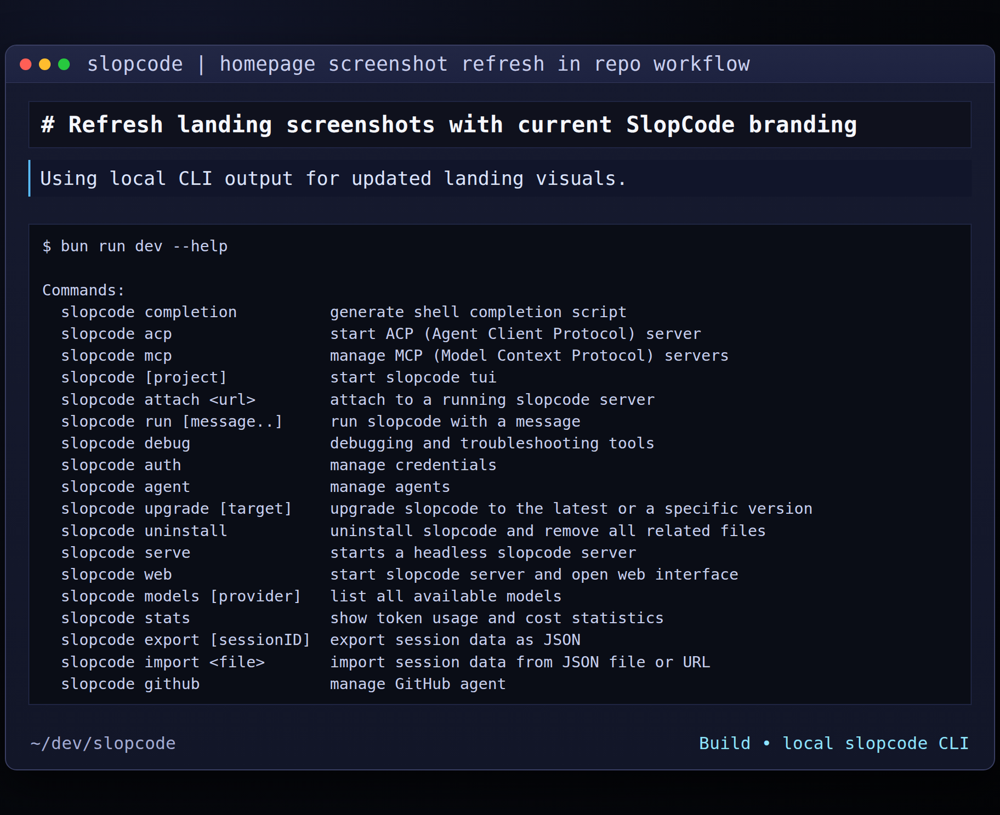

import { Tabs, TabItem } from "@astrojs/starlight/components"
import config from "../../../../config.mjs"
export const console = config.console

[**OpenCode**](/) 是一個開源 AI 編碼代理。它可用作基於 terminal 的介面、桌面應用程式或 IDE 擴展。



讓我們開始吧。

---

#### 先決條件

要在 terminal 中使用 OpenCode，您需要：

1. 現代 terminal 模擬器，例如：
   - [WezTerm](https://wezterm.org)，跨平台
   - [Alacritty](https://alacritty.org)，跨平台
   - [Ghostty](https://ghostty.org)，Linux 和 macOS
   - [Kitty](https://sw.kovidgoyal.net/kitty/)，Linux 和 macOS

2. 您想要使用的 LLM 提供商的 API 密鑰。

---

## 安裝

安裝 OpenCode 最簡單的方法是通過安裝腳本。

```bash
curl -fsSL https://opencode.ai/install | bash
```

您還可以使用以下命令安裝它：

- **使用 Node.js**

        <Tabs>

      <TabItem label="npm">
      ```bash
      npm install -g opencode-ai
      ```

          </TabItem>

        <TabItem label="Bun">
        ```bash
        bun install -g opencode-ai
        ```

          </TabItem>

        <TabItem label="pnpm">
        ```bash
        pnpm install -g opencode-ai
        ```

          </TabItem>

        <TabItem label="Yarn">
        ```bash
        yarn global add opencode-ai
        ```

      </TabItem>

  </Tabs>

- **在 macOS 和 Linux 上使用 Homebrew**

  ```bash
  brew install anomalyco/tap/opencode
  ```

  > 我們建議使用 OpenCode tap 來獲取最新版本。官方 `brew install opencode` formula 由 Homebrew 團隊維護，更新頻率較低。

- **在 Arch Linux 上使用 Paru**

  ```bash
  paru -S opencode-bin
  ```

#### Windows

:::tip[Recommended: Use WSL]
為了在 Windows 上獲得最佳體驗，我們建議使用[適用於 Linux 的 Windows 子系統 (WSL)](/docs/windows-wsl)。它提供了更好的性能並與 OpenCode 的功能完全兼容。
:::

- **使用Chocolatey**

  ```bash
  choco install opencode
  ```

- **使用Scoop**

  ```bash
  scoop install opencode
  ```

- **使用 NPM**

  ```bash
  npm install -g opencode-ai
  ```

- **使用Mise**

  ```bash
  mise use -g github:anomalyco/opencode
  ```

- **使用 Docker**

  ```bash
  docker run -it --rm ghcr.io/anomalyco/opencode
  ```

目前正在支持使用 Bun 在 Windows 上安裝 OpenCode。

您還可以從[Releases](https://github.com/anomalyco/opencode/releases) 獲取二進製文件。

---

## 配置

借助 OpenCode，您可以通過配置 API 密鑰來使用任何 LLM 提供商。

如果您不熟悉使用 LLM 提供商，我們建議使用[OpenCode Zen](/docs/zen)。
這是經過 OpenCode 測試和驗證的精選模型列表
團隊。

1. 在 TUI 中運行 `/connect` 命令，選擇 opencode，然後前往 [opencode.ai/auth](https://opencode.ai/auth)。

   ```txt
   /connect
   ```

2. 登錄，添加您的帳單詳細信息，然後復制您的 API 密鑰。

3. 粘貼您的 API 密鑰。

   ```txt
   ┌ API key
   │
   │
   └ enter
   ```

或者，您可以選擇其他提供商之一。 [了解更多](/docs/providers#directory)。

---

## 初始化

現在您已經配置了提供商，您可以導航到一個項目
你想繼續工作。

```bash
cd /path/to/project
```

並運行 OpenCode。

```bash
opencode
```

接下來，通過運行以下命令來初始化項目的 OpenCode。

```bash frame="none"
/init
```

這將使 OpenCode 分析您的項目並在以下位置創建 `AGENTS.md` 文件
項目根。

:::tip
您應該將項目的 `AGENTS.md` 文件提交到 Git。
:::

這有助於 OpenCode 理解項目結構和編碼模式
用過的。

---

## 用法

您現在已準備好使用 OpenCode 來處理您的項目。請隨意詢問
任何事物！

如果您不熟悉使用 AI 編碼代理，以下是一些可能會有所幫助的示例
幫助。

---

### 提出問題

您可以用 OpenCode 向您解釋程式碼庫。

:::tip
使用`@`鍵模糊搜索工程中的文件。
:::

```txt frame="none" "@packages/functions/src/api/index.ts"
How is authentication handled in @packages/functions/src/api/index.ts
```

如果您沒有處理程式碼庫的一部分，這會很有幫助。

---

### 添加功能

您可以用 OpenCode 向您的項目添加新功能。不過我們首先建議要求它制定一個計劃。

1. **制定計劃**

   OpenCode 有一個*計劃模式*，該模式禁用其進行更改和
   相反，建議*如何*實現該功能。

   使用 **Tab** 鍵切換到它。您會在右下角看到一個指示符。

   ```bash frame="none" title="Switch to Plan mode"
   <TAB>
   ```

   現在讓我們描述一下我們想要它做什麼。

   ```txt frame="none"
   When a user deletes a note, we'd like to flag it as deleted in the database.
   Then create a screen that shows all the recently deleted notes.
   From this screen, the user can undelete a note or permanently delete it.
   ```

   您需要為 OpenCode 提供足夠的詳細信息以了解您想要的內容。它有幫助
   就像與團隊中的初級開發人員交談一樣與它交談。

   :::tip
   為 OpenCode 提供大量上下文和示例，以幫助其理解您的內容
   想。
   :::

2. **迭代計劃**

   一旦它為您提供了計劃，您就可以提供反饋或添加更多詳細信息。

   ```txt frame="none"
   We'd like to design this new screen using a design I've used before.
   [Image #1] Take a look at this image and use it as a reference.
   ```

   :::tip
   將圖像拖放到 terminal 中以將其添加到提示中。
   :::

   OpenCode 可以掃描您提供的任何圖像並將其添加到提示中。你可以
   通過將圖像拖放到 terminal 中來完成此操作。

3. **構建功能**

   一旦您對計劃感到滿意，請切換回*構建模式*
   再次按 **Tab** 鍵。

   ```bash frame="none"
   <TAB>
   ```

   並要求它做出改變。

   ```bash frame="none"
   Sounds good! Go ahead and make the changes.
   ```

---

### 做出改變

對於更直接的更改，您可以要求 OpenCode 直接構建它
無需先審查計劃。

```txt frame="none" "@packages/functions/src/settings.ts" "@packages/functions/src/notes.ts"
We need to add authentication to the /settings route. Take a look at how this is
handled in the /notes route in @packages/functions/src/notes.ts and implement
the same logic in @packages/functions/src/settings.ts
```

您需要確保提供大量詳細信息，以便 OpenCode 做出正確的決定
變化。

---

### 撤消更改

假設您要求 OpenCode 進行一些更改。

```txt frame="none" "@packages/functions/src/api/index.ts"
Can you refactor the function in @packages/functions/src/api/index.ts?
```

但你意識到這不是你想要的。您**可以撤消**更改
使用 `/undo` 命令。

```bash frame="none"
/undo
```

OpenCode 現在將恢復您所做的更改並顯示您的原始消息
再次。

```txt frame="none" "@packages/functions/src/api/index.ts"
Can you refactor the function in @packages/functions/src/api/index.ts?
```

從這裡您可以調整提示並要求 OpenCode 重試。

:::tip
您可以多次運行 `/undo` 以撤消多項更改。
:::

或者您**可以使用 `/redo` 命令重做**更改。

```bash frame="none"
/redo
```

---

## 分享

您與 OpenCode 的對話可以[與您的
團隊](/docs/share)。

```bash frame="none"
/share
```

這將創建當前對話的連結並將其複製到剪貼板。

:::note
默認情況下不共享對話。
:::

這是帶有 OpenCode 的[示例對話](https://opencode.ai/s/4XP1fce5)。

---

## 定制

就是這樣！您現在已經是使用 OpenCode 的專家了。

要使其成為您自己的，我們建議 [選擇一個主題](/docs/themes)、[自定義按鍵綁定](/docs/keybinds)、[配置程式碼格式化程序](/docs/formatters)、[創建自定義命令](/docs/commands) 或使用 [OpenCode 配置](/docs/config)。
